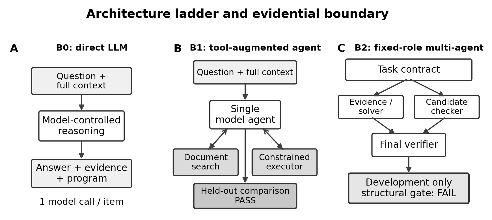
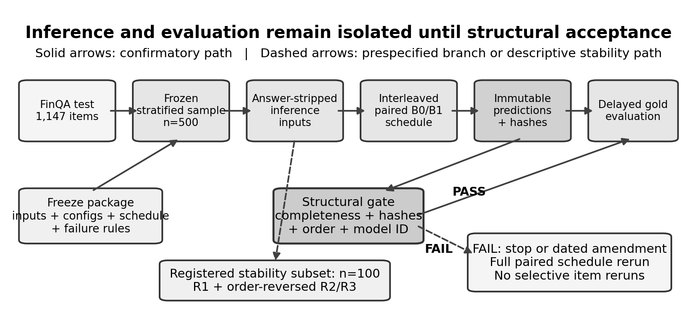
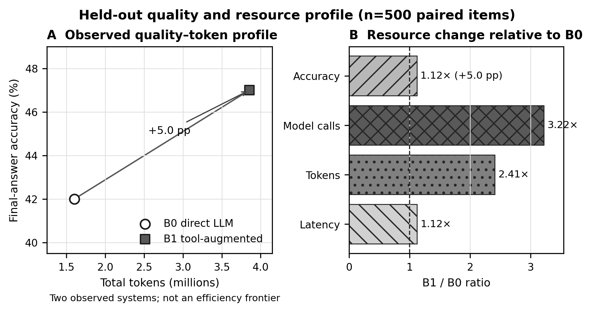

# Tool Use Before Teamwork? A Preregistered, Cost-Aware Evaluation of LLM Architectures for Financial Numerical Reasoning

<!-- Integrated working manuscript v4; second-round reviewer revision. Source v3 SHA-256: e59a90a32b77485573ed6ce2be5d69381704afe03248f27866ce633d6aa38b63. Experimental results are unchanged. -->

## Abstract

Large language model systems for financial numerical reasoning can be extended either with deterministic tools or with multiple model-controlled roles, but these interventions are often evaluated as bundled architectural changes. We conducted a preregistered, paired systems study that separated direct generation (B0), a tool-augmented single agent using deterministic document search and constrained calculation (B1), and exploratory fixed-role multi-agent pipelines (B2). B0 and B1 were compared on the same operation-stratified sample of 500 FinQA test items under balanced execution order, delayed gold access, immutable prediction artifacts, and full intention-to-test denominators. B1 answered 235/500 items correctly (47.0%) versus 210/500 for B0 (42.0%), a paired difference of +5.0 percentage points (95% bootstrap confidence interval, +1.4 to +8.8; exact McNemar p=0.01146). Program correctness increased from 18.6% to 39.0%, and executable-program correctness from 24.8% to 51.6%, whereas evidence F1 and response coverage did not improve significantly after multiplicity correction. The gain required 3.22 times as many model calls and 2.41 times as many tokens. In a preregistered 100-item, three-run stability analysis, correctness changed across runs for 12% of B0 items and 17% of B1 items. Both B2 variants failed development-stage structural gates; B2-v1.1's verifier accepted 16 incorrect candidates among 22 accepted outputs. Because no B2 implementation passed its gate, this study does not estimate the held-out marginal effect of multi-agent coordination. Deterministic tool access improved held-out financial numerical reasoning in this setting, but introduced a clear quality–cost trade-off and did not eliminate answer–program synchronization failures. Additional model-controlled roles should be evaluated as executable system components with explicit failure gates rather than assumed to provide independent verification.

**Keywords:** financial numerical reasoning; large language models; tool-augmented agents; multi-agent systems; preregistered evaluation; reliability; cost-aware evaluation

## 1. Introduction

Financial question answering is a useful stress test for large language model (LLM) systems because a plausible response is not sufficient. A system must identify the relevant facts in a long report, reconcile narrative text with tables, select the correct financial operation, preserve units and signs, and produce a numerically exact answer. FinQA made this structure explicit by pairing expert-written questions over corporate reports with supporting evidence and executable reasoning programs [@chen-etal-2021-finqa]. TAT-QA broadened the setting to hybrid tabular and textual content [@zhu-etal-2021-tat], while ConvFinQA showed that the required numerical chain may extend across conversational turns [@chen-etal-2022-convfinqa]. More recent evaluations retain the same central difficulty: performance depends jointly on evidence grounding, financial understanding, and precise computation rather than on fluent generation alone [@islam2023financebench; @krumdick-etal-2024-bizbench].

This combination creates a consequential systems-design question. When a direct LLM is unreliable, should a developer first add deterministic tools, or should the task be decomposed among multiple specialized agents? The two interventions are often discussed together but change different parts of the computational system. Tool augmentation keeps one model-controlled decision maker while externalizing functions such as retrieval or arithmetic. Multi-agent decomposition adds model-controlled roles, communication steps, handoffs, and a mechanism for selecting or verifying candidate outputs. The latter can include the former, but it also introduces additional failure surfaces and resource costs.

Prior work establishes the feasibility of both directions. Program-aided language models delegate execution to a symbolic interpreter after an LLM has translated a problem into code [@pmlr-v202-gao23f]. ReAct interleaves model reasoning with actions against external information sources [@yao2023react], and Toolformer studies how a model can learn when and how to invoke APIs [@schick2023toolformer]. In parallel, CAMEL uses role-playing to structure cooperation among conversational agents [@li2023camel], AutoGen provides programmable multi-agent conversation patterns [@wu2023autogen], and ChatDev organizes software-development work across role-specialized agents and sequential phases [@qian-etal-2024-chatdev]. These systems demonstrate that tools and role decomposition can expand what an LLM-based application can do.

Feasibility, however, does not establish the marginal value of architectural complexity. A multi-agent system commonly receives more model calls, longer prompts, additional intermediate outputs, and sometimes new tools. An apparent gain may therefore reflect a larger inference budget rather than role specialization itself. Conversely, coordination can propagate an early error, exhaust a shared budget before final checking, or convert a syntactically valid handoff into a semantically inconsistent result. A recent trace-based study of seven multi-agent systems identifies failures in system design, inter-agent alignment, and task verification, underscoring that additional agents do not automatically provide independent error correction [@cemri2025why]. The same concern applies to a nominal verifier: research on trained outcome and process verifiers shows that verification is a substantive capability that must be learned and evaluated [@cobbe2021training; @lightman2023verify], not a property conferred merely by assigning a model the role name “verifier.”

The resulting evidence gap is methodological. Financial-reasoning studies typically compare models or end-to-end systems, while agent studies often compare complete frameworks with multiple simultaneous differences. What is still needed is a controlled architecture ladder that asks a narrower question first: under the same provider, item set, output contract, and paired execution schedule, what changes when deterministic tools are added to a single agent? Only after that comparison is structurally valid should extra model-controlled roles be treated as an additional intervention. Such an evaluation should also distinguish final-answer correctness from program executability and evidence grounding, count failures in the full intention-to-test denominator, and report the model-call, token, tool-call, and latency costs attached to any quality change.

We address this gap with a preregistered systems study on FinQA. The architecture ladder contains (B0) direct generation, (B1) a tool-augmented single agent with deterministic document search and constrained program execution, and (B2) fixed-role multi-agent variants developed for task-contract construction, evidence-oriented solving, candidate checking, and final verification. B0 and B1 passed the development-stage structural gates and form the confirmatory held-out comparison. The B2 variants did not complete the frozen development protocol without structural failures; they are therefore retained only for exploratory mechanism analysis rather than promoted to the held-out confirmatory test. This boundary is important: a more elaborate architecture is not treated as a valid experimental condition until it can reliably produce the preregistered artifact.

The held-out design froze a deterministic, operation-stratified sample of 500 FinQA test items before inference. B0 and B1 were evaluated on the same items with balanced within-pair execution order. The primary outcome was full-sample final-answer correctness, analyzed with an exact paired test. Secondary outcomes covered canonical-program correctness, executable-program correctness, evidence F1, and response coverage; resource and stability measurements characterized the quality–cost trade-off. Inference artifacts were answer stripped, predictions were made immutable before evaluation, and returned model identifiers were logged because a provider alias may not denote an immutable backend snapshot.

This study makes four contributions:

1. It formulates a controlled architecture ladder that separates direct generation, deterministic tool augmentation, and fixed-role multi-agent decomposition instead of treating them as one bundled “agentic” intervention.
2. It preregisters a paired, held-out comparison of B0 and B1 with full-denominator outcome definitions, delayed gold access, structural acceptance gates, and explicit controls for execution order and provider-side model drift.
3. It evaluates financial reasoning as an auditable system output—answer, evidence identity, and executable program—while reporting model calls, tool calls, tokens, latency, and cost per correct answer.
4. It treats the B2 development failures as mechanism evidence, including coordination, contract, budget, and false-acceptance failures, without generalizing those formative observations to all multi-agent architectures.

The paper therefore does not assume that tools are always preferable to teamwork, or that multi-agent systems are intrinsically unreliable. It tests a sequential engineering claim: before attributing value to additional model-controlled roles, a study should establish what a single agent gains from deterministic tools and whether the multi-agent implementation itself satisfies the same reliability contract. On the registered held-out sample, B1 improved final-answer accuracy by five percentage points over B0, but required substantially more calls and tokens; the B2 implementations failed their development-stage structural gates. The resulting evidence favors tool use before additional teamwork in this implementation and task setting, while preserving a strict boundary against generalizing the B2 result to multi-agent systems as a class.

## 2. Related Work

### 2.1 Financial numerical reasoning and grounded evaluation

Financial numerical reasoning differs from generic arithmetic because the operands and operations must first be grounded in domain documents. FinQA combines text and tables from financial reports, expert-authored questions, supporting facts, and executable programs [@chen-etal-2021-finqa]. Its program representation makes at least three error sources separable: selecting the wrong evidence, choosing the wrong operation, and executing or reporting the calculation incorrectly. This decomposition motivates our use of answer correctness, official evidence identifiers, and program-based outcomes rather than a single free-form answer score.

TAT-QA similarly requires reasoning across hybrid tables and prose and includes operations such as addition, subtraction, multiplication, division, counting, and comparison [@zhu-etal-2021-tat]. ConvFinQA extends numerical reasoning into a conversational setting in which intermediate results and prior turns become part of the reasoning state [@chen-etal-2022-convfinqa]. These benchmarks show that financial QA is not one homogeneous task: evidence location, representation type, operation family, and reasoning depth all affect system behavior. Our deterministic held-out stratification uses the reference FinQA program to preserve common operations while ensuring coverage of rare operations, but the primary estimand remains the registered 500-item sample rather than an unrestricted claim about financial intelligence.

FinanceBench shifts attention toward open-book questions about public companies and includes answer-linked evidence, highlighting practical retrieval and grounding limitations in contemporary LLM configurations [@islam2023financebench]. BizBench aggregates quantitative business and finance tasks and explicitly evaluates program synthesis, document parsing, financial concepts, and formula use [@krumdick-etal-2024-bizbench]. Together, these studies support two design choices in our evaluation. First, final answers should be accompanied by evidence and a machine-checkable computational trace when the task permits it. Second, the performance claim must remain bounded by the benchmark: success on FinQA cannot by itself establish reliability for forecasting, advisory, compliance, or other open-ended financial decisions.

Our work is thus not a new benchmark proposal. It uses FinQA as a controlled test bed for an architecture question. The contribution lies in holding the evaluation items and output contract constant while changing how the system obtains evidence and performs computation.

### 2.2 Deterministic tools as a boundary around model-controlled reasoning

Tool-augmented LLM research separates tasks that benefit from probabilistic language understanding from operations that can be delegated to external mechanisms. PAL asks the model to translate a natural-language problem into a program and leaves execution to an interpreter, reducing reliance on the model for exact arithmetic [@pmlr-v202-gao23f]. ReAct integrates reasoning traces with actions so that a model can gather information from an external source and revise its plan during execution [@yao2023react]. Toolformer studies a complementary learning problem: deciding which API to call, when to call it, what arguments to supply, and how to incorporate the result [@schick2023toolformer].

These approaches clarify why “using tools” is not a single treatment. A system can vary in whether tool selection is learned or prompted, whether retrieval is model based or deterministic, whether execution is general-purpose or constrained, and whether tool failure is visible to the evaluator. Our B1 design adopts a deliberately narrow intervention. One model-controlled agent can call deterministic lexical document search and a constrained FinQA executor. The tools do not decide the answer: the model remains responsible for recognizing what evidence is needed, selecting operations, supplying arguments, reconciling units, and returning a schema-valid result. This boundary lets the evaluation ask whether externalizing retrieval and calculation changes accuracy and auditability without simultaneously adding role-based coordination.

The distinction is especially relevant in finance. A calculator can faithfully execute the wrong formula, and a retriever can return text that is lexically relevant but financially inappropriate. Tool access should therefore be evaluated not only through the final answer, but also through the predicted program, execution result, cited evidence, failed-tool rate, and unsupported-claim rate. Resource accounting is equally necessary: extra interaction turns may improve quality while increasing tokens or calls. We consequently describe any improvement alongside its measured cost rather than equating higher accuracy with higher efficiency.

### 2.3 Role-specialized multi-agent systems

LLM-based multi-agent frameworks use communication and role specialization to decompose tasks that may be difficult for one model invocation. CAMEL studies autonomous cooperation through role-playing and inception prompting [@li2023camel]. AutoGen exposes customizable agents and conversation patterns that can combine models, human input, and tools [@wu2023autogen]. ChatDev applies a chat chain to software development, assigning specialized roles across design, coding, and testing phases [@qian-etal-2024-chatdev]. Although their application domains and evaluation protocols differ, these systems share the proposition that structured interaction among specialized roles can yield useful intermediate artifacts and distribute cognitive work.

Finance-specific agent research has begun to move beyond question answering toward end-to-end workflows. FinRobot organizes financial analysis through a multi-agent framework, while InvestorBench evaluates LLM-based investment agents in financial decision-making settings; a recent survey maps the broader design space of finance-oriented agents [@yang2024finrobot; @li-etal-2025-investorbench; @dong-etal-2025-finance-agents]. These studies demonstrate the breadth of possible financial-agent applications. They do not, however, remove the need for matched architectural comparisons: an end-to-end agent framework can differ from a baseline in tools, prompts, roles, interaction turns, and inference budget simultaneously. The present study therefore uses a narrower numerical-reasoning task to isolate the first architectural increment before making any claim about additional coordination.

The same structure introduces dependencies that a single-agent evaluation does not contain. Each handoff must preserve the task specification, evidence boundary, intermediate values, units, and remaining budget. A downstream role may inherit an incorrect premise, and repeated agreement among agents instantiated from similar models may not constitute independent corroboration. Communication also consumes context and tokens that would otherwise be available for solving or checking. The relevant experimental unit is therefore the complete system, not the apparent competence of any named role in isolation.

Cemri et al. analyze more than 1,600 traces from seven multi-agent systems and organize observed failures into system-design issues, inter-agent misalignment, and task-verification failures [@cemri2025why]. Their taxonomy provides external support for mechanism-level analysis, but it does not determine whether a particular architecture will fail on FinQA. Our B2 analysis is correspondingly local and exploratory. We record failures such as evidence-contract violations, budget exhaustion, cross-field inconsistency, output-ceiling failures, and verifier false acceptance in the implemented fixed-role pipelines. Because those pipelines failed frozen development acceptance gates, we do not use their development accuracy to make a confirmatory claim about multi-agent systems as a class.

This treatment differs from comparisons that place a single call against a substantially larger agent team and interpret the score difference as the effect of “collaboration.” Our architecture ladder records model calls, tool calls, tokens, and latency, and it requires structural validity before performance is interpreted. The intended comparison is not people-like teamwork versus individual work; it is one executable software architecture versus another.

### 2.4 Verification is an evaluated capability, not a role label

Verification can improve reasoning when it is explicitly trained and supplied with suitable candidates and supervision. Cobbe et al. train a verifier to rank candidate solutions to mathematical word problems and show that verifier-based selection can improve performance [@cobbe2021training]. Lightman et al. compare outcome supervision with process supervision and report benefits from feedback at intermediate reasoning steps on mathematical problems [@lightman2023verify]. These results establish that a verifier may add value, but they also imply that verification quality depends on its training objective, supervision, inputs, and decision rule.

A prompted agent assigned to “verify” a financial solution is not equivalent to a trained reward model or a deterministic program checker. It may share the solver’s blind spots, overlook an evidence mismatch, or accept a fluent but incorrect calculation. For this reason, our B2 diagnostic does not count verifier activity as evidence of reliability. It measures accepted-candidate correctness and reports false acceptance directly. In the confirmatory B0/B1 comparison, deterministic program execution provides a separate observable, while final-answer scoring remains independent of the system’s self-reported confidence or status.

This distinction also motivates the separation of syntactic and semantic gates. JSON-schema validity establishes that a prediction can be parsed; it does not establish agreement among the answer, program, evidence, unit, and status fields. An auditable evaluation must preserve these fields and score their relationships after predictions have been frozen.

### 2.5 Agent evaluation as system evaluation

Interactive-agent benchmarks increasingly evaluate complete systems rather than isolated language-model responses. AgentBench tests agents across heterogeneous interactive environments and exposes failures that are invisible in static answer scoring [@liu2024agentbench]. τ-bench extends this perspective to tool-using interactions and evaluates repeated-trial reliability through pass^k-style measures, making clear that a system's success probability across repeated runs is distinct from its one-shot score [@yao2025taubench]. Kapoor et al. further argue that agent evaluations require held-out test sets, cost-controlled comparisons, and reproducible evaluation artifacts because architectural changes often alter both capability and inference budget [@kapoor2025agents].

These principles motivate the unit of analysis in this paper. We evaluate the full executable pipeline, count unsuccessful outputs in the registered denominator, preserve call and token costs, and separate development gates from held-out inference. The three-run stability analysis is descriptive rather than an inflation of the primary sample, and the B2 systems are withheld from confirmatory comparison because an architecture that cannot reliably produce the registered artifact is not yet a valid treatment condition.

### 2.6 Study position

The closest lines of work provide complementary pieces rather than the full design used here. Financial QA benchmarks define grounded numerical tasks and, in some cases, executable programs. Tool-augmented reasoning externalizes retrieval or computation. Multi-agent frameworks add role-based decomposition and communication. Verifier research studies candidate selection and intermediate checking. Our study connects these strands through a controlled and preregistered architecture evaluation.

Three boundaries define the contribution. First, the confirmatory claim is limited to B1 versus B0 on a frozen, paired FinQA sample; B2 remains exploratory because it did not satisfy the development acceptance gates. Second, system quality is multidimensional but not collapsed into an ad hoc composite score: final-answer correctness is primary, while programs, execution, evidence, coverage, reliability, stability, and resources remain separately observable. Third, the evaluation is designed for auditability under a live provider API: inference and gold artifacts are separated, predictions are frozen before scoring, paired order is balanced, and returned model identifiers are retained. These choices turn the broad question “Are agents useful in finance?” into a reproducible systems question: what reliability and cost changes are attributable to deterministic tool access before additional model-controlled coordination is introduced?

## 3. Methods

### 3.1 Study design and research questions

We conducted a controlled, paired systems study of large-language-model architectures for financial numerical reasoning. The design separates three architectural ideas that are often changed simultaneously in agent evaluations: direct generation, deterministic tool augmentation, and fixed-role multi-agent decomposition. The confirmatory comparison is restricted to the two systems that passed the development-stage structural gates: a direct-LLM baseline (B0) and a tool-augmented single agent (B1). Two fixed-role multi-agent implementations (B2-v1 and B2-v1.1) are retained only for exploratory failure analysis because neither completed the frozen development protocol without structural failures.

The study addresses four research questions:

- **RQ1:** Does deterministic tool augmentation change final-answer accuracy relative to direct generation on a preregistered held-out sample of financial numerical-reasoning items?
- **RQ2:** How does tool augmentation affect executable-program correctness, evidence grounding, response coverage, and structural reliability?
- **RQ3:** What model-call, tool-call, token, and latency costs accompany any observed quality difference?
- **RQ4:** How stable are paired outcomes and resource measurements when the provider exposes a dynamic model alias rather than an immutable model snapshot?

The primary null hypothesis is that B0 and B1 have equal item-level final-answer correctness probabilities. Development evidence motivated an expected direction in favor of B1, but the preregistered primary test is two-sided. No confirmatory hypothesis is assigned to B2.

### 3.2 Architecture ladder and controlled factors

#### 3.2.1 B0: direct LLM

B0 receives the sample identifier, dataset name, question, and complete document context in one structured request. The prompt requires a scalar answer or abstention, official evidence identifiers, and a FinQA-style program when calculation is needed. B0 has no retrieval or calculation tools and receives one model call per item. Its maximum output allowance is 32,768 tokens.

#### 3.2.2 B1: tool-augmented single agent

B1 uses one model-controlled agent and exposes two deterministic local tools. `search_document` performs lexical BM25-style ranking over the permitted document and returns exact source identifiers. Its first invocation is fixed at `top_k=12`. `calculate_finqa` executes a constrained sequence of arithmetic, comparison, exponentiation, or table-aggregation operations and returns a canonical program plus the deterministic result. The model may make at most six calls and eight tool calls per item under a cumulative 32,768-output-token ceiling. There are no specialized sub-agents, task-contract agent, hidden verifier, or inter-agent conflict mechanism.

#### 3.2.3 B2: exploratory fixed-role multi-agent systems

B2-v1 and B2-v1.1 introduce fixed functional roles for task-contract construction, evidence-oriented solving, candidate checking, and final verification. These systems were evaluated only during development. Their results are not included in the held-out confirmatory test, because the frozen 30-item development runs contained incomplete structured pipelines and failed their acceptance gates. B2 is used to study coordination overhead, evidence-contract violations, shared-budget failure, and verifier false acceptance—not to estimate held-out multi-agent performance.

**Table 1. Frozen system boundaries and controlled factors**

| Factor | B0 direct LLM | B1 tool-augmented single agent | B2 fixed-role multi-agent |
|---|---|---|---|
| Confirmatory held-out status | Included | Included | Excluded |
| Model-controlled roles | 1 | 1 | Multiple fixed roles |
| Document access | Full context in initial prompt | Deterministic retrieval tool | Role-specific evidence flow |
| Deterministic calculator | No | Yes | Yes, role mediated |
| Model-call ceiling per item | 1 | 6 | Development configurations only |
| Tool-call ceiling per item | 0 | 8 | Development configurations only |
| Output ceiling | 32,768 | 32,768 cumulative | Development configurations only |
| Semantic retries | 0 | 0 | 0 |
| Provider storage | Disabled | Disabled | Disabled |
| Confirmatory role | Baseline | Treatment | None; exploratory failure analysis |

The confirmatory systems use the same provider, requested model alias (`deepseek-flash`), item set, output ceiling, evaluator, evidence identifiers, zero-retry rule, and paired temporal schedule. Tool availability and the resulting interaction loop are the intended architectural differences. Because the provider alias may resolve to changing backend snapshots, all returned model identifiers and timestamps are retained as protocol evidence rather than assuming snapshot immutability.

**Figure 1. Architecture ladder and claim boundary.** B0 and B1 entered the preregistered held-out comparison. B2 remained development-only because its fixed-role implementations failed the structural acceptance gates. Boxes with solid borders are model-controlled components; shaded boxes are deterministic tools or gates.

### 3.3 Dataset, development boundary, and held-out sampling

#### 3.3.1 Dataset

FinQA is a financial question-answering dataset grounded in corporate reports and paired with executable numerical programs and supporting evidence [@chen-etal-2021-finqa]. The local normalized data comprise 6,251 training items, 883 development items, and 1,147 test items. The confirmatory source is the normalized test file with SHA-256:

`da64fbde6763d0832a04c4f17e7a945bb3f195ab23e12bc57b31167a5b745541`.

The repeatedly used 30-item development diagnostic set is permanently excluded from confirmatory inference. It served only to verify interfaces, identify failure mechanisms, and formulate the preregistered hypothesis. No development-set p-value is used to support the paper's final performance claims.

#### 3.3.2 Deterministic stratified selection

We froze a 500-item held-out sample before any test predictions were generated. Each test item was assigned to one mutually exclusive operation stratum using its reference program. Rare operations received minimum quotas; all remaining slots were allocated in proportion to residual stratum capacity using the largest-remainder rule. Within strata, selection was determined by SHA-256 ranking over the protocol identifier, frozen dataset hash, and sample identifier. No post-registration substitution is permitted.

Let (N_s) denote the eligible count in stratum (s), (m_s) its minimum quota, and (N=500) the target sample size. After assigning the minima, the residual (R=N-\sum_s m_s) was distributed in proportion to (N_s-m_s), with remaining integer slots assigned by descending fractional remainder. This procedure produces a stress-aware evaluation sample while keeping the common strata approximately proportional to the held-out pool.

**Supplementary Table S1. Frozen held-out allocation by operation stratum**

| Stratum | Eligible test items | Minimum quota | Final sample |
|---|---:|---:|---:|
| Comparison | 20 | 10 | 14 |
| Contains exponentiation | 3 | 3 | 3 |
| Two-step arithmetic | 407 | 0 | 166 |
| Three-step arithmetic | 55 | 0 | 22 |
| Four-step arithmetic | 10 | 8 | 9 |
| Five-step arithmetic | 16 | 10 | 12 |
| Single addition | 54 | 0 | 22 |
| Single division | 367 | 0 | 149 |
| Single multiplication | 36 | 0 | 15 |
| Single subtraction | 140 | 0 | 57 |
| Table average | 15 | 8 | 11 |
| Table maximum | 10 | 6 | 8 |
| Table minimum | 4 | 4 | 4 |
| Table sum | 10 | 6 | 8 |
| **Total** | **1,147** | **55** | **500** |

The unweighted primary estimand therefore applies to this preregistered stress-aware sample mix. A secondary descriptive estimate reweights stratum-specific effects to the prevalence of each stratum in all 1,147 test items; it does not replace the primary paired test.

### 3.4 Output contract, evidence identity, and deterministic execution

Both confirmatory systems must return the same structured fields: `sample_id`, `answer`, `evidence`, `status`, `program`, and `unit`. Responses with missing or additional contract fields are schema invalid. Evidence is represented by official source identifiers rather than free-text overlap. For FinQA, pre-table and post-table sentences share a merged text-index sequence, and table rows retain their official row identifiers. This design makes grounding errors distinguishable from lexical paraphrase differences.

Predicted FinQA programs are parsed and executed by the same deterministic local executor. Supported operations are addition, subtraction, multiplication, division, exponentiation, numerical comparison, table average, table sum, table maximum, and table minimum. References to earlier steps use `#0`, `#1`, and subsequent indices. The gold evaluation artifact includes the document-table context required to execute table operations, but neither inference runtime contains a gold field or gold path.

Each request and tool event is logged with the protocol identifier, item identifier, requested and returned model names, timestamps, prompt or payload hash, token counts, latency, output, tool trace, and sanitized error classification. Provider reasoning text is not retained.

### 3.5 Inference–evaluation isolation

The held-out pipeline uses separate artifacts for inference and evaluation:

1. The **inference artifact** contains only sample identity, dataset split, question, documents, and schema version. It contains no reference answer, program, evidence, raw-answer metadata, or execution answer.
2. The **gold evaluation artifact** contains sample identity, reference answer, program, evidence, and the document context needed for program execution.
3. The **runtime configurations** contain the inference and schedule hashes but no key or path containing the term `gold`.

The live inference runner reads only the runtime configuration, answer-stripped inference artifact, and frozen schedule. Evaluation cannot begin until every expected prediction is immutable, the prediction files have recorded SHA-256 values, and sample-identity and duplication gates have passed. Thirty-one local checks verify artifact hashes, sample identity, forbidden keys, schedule completeness, order balance, and runtime authorization state.

### 3.6 Paired execution, temporal blocking, and stability design

The primary schedule contains 1,000 tasks: B0 and B1 are executed consecutively for each of 500 items. SHA-256 ranking assigns exactly 250 items to B0-first order and 250 to B1-first order. This paired temporal blocking reduces, but cannot eliminate, confounding caused by provider-side model or load changes.

A deterministic 100-item subset is reserved for stability analysis. Each system receives two additional runs on these items, yielding three total observations per system and item when the primary run is included. In each additional replicate, B0 and B1 are first for 50 items each. The first system is reversed for every item between replicates 2 and 3. Stability replicates are analyzed separately and are never pooled into the primary McNemar test.

All returned model identifiers are recorded. A within-pair mismatch is a protocol deviation. If more than 1% of pairs contain mismatched returned model identifiers, confirmatory analysis pauses before unblinding and requires a dated amendment.

**Figure 2. Preregistered inference–evaluation pipeline.** The 500-item sample, answer-stripped inputs, paired schedule, runtime hashes, and failure rules were frozen before live inference. Prediction hashes and structural gates preceded gold access; a failed gate required stopping or a dated full-schedule amendment rather than selective item reruns.

### 3.7 Outcomes

#### 3.7.1 Primary outcome

The primary outcome is item-level final-answer correctness under an intention-to-test (ITT) rule. A response is correct only if `status=answered` and its answer matches the reference under the frozen numeric/text normalization. Missing predictions, abstentions, schema-invalid outputs, transport failures, and other error outputs are scored incorrect. The primary effect is the paired B1-minus-B0 accuracy difference in percentage points.

#### 3.7.2 Secondary outcomes

Four secondary outcomes form one multiplicity-controlled family:

- **Program ITT correctness:** exact canonical-program match; missing or invalid programs are false, with all 500 items in the denominator.
- **Execution ITT correctness:** the predicted program executes to the reference answer; missing, invalid, or non-executing programs are false, with all 500 items in the denominator.
- **Evidence F1:** item-level F1 over official evidence identifiers, including zero-valued items.
- **Coverage:** `status=answered`, with all 500 items in the denominator.

Selective program and execution accuracies may be reported descriptively to explain conditional behavior but are not substituted for the preregistered ITT outcomes.

#### 3.7.3 Reliability, cost, and stability outcomes

Reliability measures include schema-valid completion, infrastructure-failure rate, failed-tool rate, unit/scale error rate, unsupported-claim rate, and returned-model mismatch rate. Resource measures include model calls, tool calls, input tokens, output tokens, reasoning tokens, total tokens, wall-clock latency, and each resource per correct answer. Because token and latency distributions are expected to be skewed, both totals and median/interquartile-range summaries are reported.

Stability outcomes include each item's success frequency over three runs and within-item dispersion in tokens and latency. Stability is descriptive and does not create additional confirmatory observations.

### 3.8 Statistical analysis

#### 3.8.1 Primary paired comparison

Let (n_{10}) be the number of items answered correctly by B1 and incorrectly by B0, and (n_{01}) the reverse. The primary test is the two-sided exact conditional McNemar test at \(\alpha=0.05\), conditional on (n_{10}+n_{01}) discordant pairs and using a null success probability of 0.5 [@mcnemar1947]. We report (n_{10}), (n_{01}), the exact p-value, the absolute paired accuracy difference, and a 95% paired bootstrap confidence interval based on 10,000 item-level resamples with seed 20260929 [@efron1979]. The p-value is interpreted only after the structural acceptance gates pass.

#### 3.8.2 Secondary family

Program ITT correctness, execution ITT correctness, and coverage are compared with two-sided exact McNemar tests. Evidence F1 is compared with a paired Monte Carlo sign-flip test using 100,000 draws and seed 20260930. The four p-values are adjusted by Holm's step-down procedure [@holm1979]. Stratum-specific, step-depth, table-versus-arithmetic, and evidence-count analyses are explicitly exploratory; they receive effect estimates and uncertainty intervals but no claims of adequately powered subgroup significance.

#### 3.8.3 Population-weighted secondary estimate

For descriptive transport back to the full FinQA test composition, let (w_s=N_s/1147) be the test-pool prevalence of stratum (s), and let \(\hat\Delta_s\) be the paired accuracy difference within the registered sample from that stratum. The weighted effect is

\[
\hat\Delta_{w}=\sum_s w_s\hat\Delta_s.
\]

This estimate is labelled secondary because rare-stratum sample sizes remain small and the deterministic sample was designed for coverage rather than probability sampling.

#### 3.8.4 Resource comparisons

Token, call, and latency differences are summarized per paired item and through cost per correct answer. Paired bootstrap intervals use the same 10,000-resample design. Resource outcomes are descriptive; they do not determine whether the primary hypothesis is accepted. Accuracy–cost trade-offs are interpreted jointly rather than collapsing them into an unregistered scalar utility score.

### 3.9 Power sensitivity

Power was calculated before live held-out execution using the unconditional power of the two-sided exact conditional McNemar test. The number of discordant pairs was modelled as \(D\sim\mathrm{Binomial}(N,q)\), where (q) is total discordance; conditional B1-only correctness was modelled as \(X\mid D\sim\mathrm{Binomial}(D,\theta)\). At (N=500), exact power is 0.8024 for a five-percentage-point net difference with 15% total discordance, 0.9612 for a 7.5-point difference with 20% discordance, and 0.9992 for a ten-point difference with 20% discordance. These are design assumptions, not observed effects.

### 3.10 Failure rules, authorization, and reproducibility

No automatic retry, semantic retry, item-specific prompt change, or sample substitution is allowed. Infrastructure failure is defined as no HTTP response, provider 5xx/429, connection failure, or provider-side timeout before a completed response. Schema-invalid or semantically wrong model outputs are system failures, not infrastructure failures. If either system exceeds a 2% infrastructure-failure rate, the between-system infrastructure-failure difference exceeds one percentage point, or returned-model mismatches exceed 1% of pairs, analysis stops before unblinding. Any rerun requires a dated amendment and repeats the complete paired schedule rather than selected items.

The frozen protocol covers 34 hashed data, configuration, code, test, and report files. Runtime configurations remained immutable; live primary and stability execution was enabled only through dated authorization artifacts bound to the frozen runtime hash and experiment scope. Before live inference, the source code, manifests, schedules, power analysis, and local audit passed 62 unit tests, two no-network dry runs, and a read-only lock verification. After analysis, the same 62 tests passed again and the lock verification reported no hash mismatch among the 34 frozen files.

## 4. Experiments and Results

### 4.1 Formative development evidence

The development phase used the same 30 FinQA development items repeatedly to stabilize interfaces and locate architectural failure modes. These results are formative and are neither independent test estimates nor inputs to confirmatory significance testing.

**Supplementary Table S2. Formative development evidence for the architecture ladder**

| System | Structural status | Completed items | Final-answer accuracy | Selective execution accuracy | Execution coverage | Evidence macro F1 | Model calls | Total tokens | Total latency (s) |
|---|---|---:|---:|---:|---:|---:|---:|---:|---:|
| B0 direct LLM | Passed | 30/30 | 0.4000 | 0.1852 | 0.9000 | 0.9211† | 30 | 92,425 | 246.27 |
| B1 tool-augmented single agent | Passed | 30/30 | 0.5000 | 0.5667 | 1.0000 | 0.9089 | 94 | 200,561 | 188.92 |
| B2-v1 fixed-role multi-agent | Failed | 27/30 | 0.3000 | 0.5185 | 0.9000 | 0.6913 | 180 | 372,859 | 899.96 |
| B2-v1.1 fixed-role multi-agent | Failed | 23/30 | 0.2000 | 0.4348 | 0.7667 | 0.6278 | 170 | 318,823 | 725.98 |

† B0 evidence scores use the deterministic migration to official evidence identifiers; answer and program results are unchanged. Execution accuracy in this formative table follows the historical selective denominator and must not be compared as though it were the frozen held-out ITT execution outcome. B2 error records are included for diagnosis.

B1 showed a development-stage signal of higher final-answer and execution performance than B0, while consuming approximately 2.17 times as many total tokens. Pairwise, all 12 B0-correct items were also B1-correct, and B1 alone solved three additional items. This pattern motivated the held-out hypothesis but is not presented as confirmatory evidence.

Both B2 versions consumed more resources and failed their structural gates. B2-v1.1 accepted 22 candidates, of which 16 were ultimately incorrect, corresponding to a formative verifier false-acceptance rate of 72.73%. This observation motivates a mechanism-focused analysis of verification quality rather than the claim that multi-agent systems are generally inferior.

### 4.2 Confirmatory run integrity

The structural gate was evaluated before any gold access. All 1,000 scheduled records were present, both systems had 500 unique predictions, the 250/250 first-system balance was preserved, infrastructure-failure and model-drift rates were zero, and prediction hashes matched the inference summary. The first sandboxed attempt failed at DNS resolution before provider contact and consumed zero model calls; a dated amendment then authorized a complete full-schedule rerun rather than selected-item retries.

**Run-integrity checklist**

| Gate | Frozen requirement | Observed status |
|---|---:|---|
| Scheduled task records | 1,000 | 1,000 (pass) |
| Unique predictions per system | 500 | B0=500; B1=500 |
| Duplicate predictions | 0 | 0 (pass) |
| B0-first/B1-first pairs | 250/250 | 250/250 (pass) |
| Runtime/config hashes | Exact match | Exact match (pass) |
| Infrastructure failures | ≤2% each and difference ≤1 pp | B0=0%; B1=0%; difference=0 pp (pass) |
| Returned-model mismatched pairs | ≤1% | 0/500 mismatched pairs (pass) |
| Prediction files hashed before evaluation | Required | B0 and B1 SHA-256 recorded before gold access (pass) |

Preregistered gate decision: **PASS; unblinding permitted**.  
Any protocol amendment: **`config/authorizations/sci_heldout_primary_rerun1_amendment_2026-09-29.json`**.

### 4.3 Primary held-out result

**Table 2. Preregistered paired held-out comparison of B0 and B1**

| Outcome | B0 | B1 | B1−B0 | 95% paired CI | Paired discordance | Exact p-value |
|---|---:|---:|---:|---:|---|---:|
| Final-answer ITT accuracy | 42.0% (210/500) | 47.0% (235/500) | +5.0 percentage points | [+1.4, +8.8] percentage points | B1-only=58; B0-only=33 | 0.01146 |

B0 answered 210 of 500 items correctly (42.0%), whereas B1 answered 235 correctly (47.0%). The paired difference was +5.0 percentage points (95% paired bootstrap CI, +1.4 to +8.8). There were 58 B1-only correct pairs and 33 B0-only correct pairs; the two-sided exact McNemar p-value was 0.01146. Under the preregistered stress-aware FinQA sample, tool augmentation therefore improved final-answer correctness relative to direct generation. The prevalence-weighted descriptive estimate for the full FinQA test composition was similar (+5.67 percentage points).

### 4.4 Secondary quality and reliability results

**Table 3. Preregistered secondary outcomes**

| Outcome | B0 | B1 | B1−B0 | Unadjusted p | Holm-adjusted p | Interpretation status |
|---|---:|---:|---:|---:|---:|---|
| Program ITT correctness | 0.1860 | 0.3900 | +0.2040 | 4.7409×10^-24 | 1.4223×10^-23 | Holm-significant |
| Execution ITT correctness | 0.2480 | 0.5160 | +0.2680 | 2.0818×10^-29 | 8.3272×10^-29 | Holm-significant |
| Evidence item-level F1 | 0.8367 | 0.8260 | −0.0107 | 0.27263 | 0.54525 | Not significant |
| Coverage | 0.9900 | 0.9820 | −0.0080 | 0.34375 | 0.54525 | Not significant |

Program ITT correctness increased from 0.1860 to 0.3900, and execution ITT correctness increased from 0.2480 to 0.5160; both differences remained significant after Holm correction. Coverage decreased from 0.9900 to 0.9820 and evidence F1 decreased from 0.8367 to 0.8260; neither difference was significant after correction. The population-prevalence-weighted answer difference was +5.67 percentage points, close to the unweighted preregistered difference of +5.0 points. Selective metrics are retained only as diagnostics and are not substituted for the full-sample ITT outcomes.

### 4.5 Resource use and the quality–cost trade-off

**Table 4. Held-out resource and efficiency results**

| Measure | B0 | B1 | Paired difference or ratio |
|---|---:|---:|---:|
| Total model calls | 500 | 1,610 | 3.22× |
| Total tool calls | 0 | 1,113 | — |
| Total tokens | 1,603,138 | 3,856,862 | 2.41× |
| Median tokens/item (IQR) | 2,552 (2,084–3,303) | 5,994 (5,721–6,714) | mean +4,507 [95% CI +4,083 to +4,963] |
| Total latency | 4,444.4 s | 4,981.8 s | 1.12× |
| Median latency/item (IQR) | 6.12 (4.41–9.25) s | 6.07 (5.45–7.65) s | mean +1.07 s [95% CI −0.84 to +4.03] |
| Tokens/correct answer | 7,634 | 16,412 | 2.15× |
| Latency/correct answer | 21.16 s | 21.20 s | 1.00× |

B1's accuracy gain required 3.22 times as many model calls and 2.41 times as many tokens as B0. Its median latency per item was similar to B0 (6.07 versus 6.12 s), but total latency was 12% higher and the paired mean-latency difference had a wide interval that included zero because of a 608-s completed-response outlier. Tokens per correct answer increased from 7,634 to 16,412, while latency per correct answer remained nearly unchanged (21.16 versus 21.20 s). The result is therefore a quality–token-cost trade-off, not a general efficiency gain.

**Figure 3. Observed quality–cost profile.** B1 improved final-answer accuracy by 5.0 percentage points while using 3.22× as many model calls and 2.41× as many tokens. The line connects the two evaluated systems for visual comparison; with only two architectures, it is not an estimated efficiency frontier.

### 4.6 Stability under repeated calls

The separately authorized stability run completed all 400 scheduled system tasks. Before gold access, its structural audit confirmed four 100-prediction groups without duplicates, exact schedule and runtime-hash agreement, 50:50 first-system balance within each additional replicate, and reversal of first-system order for all 100 items between R2 and R3. All 842 returned calls reported the same provider model identifier. B0 had no system-output failures; B1 had three completed but unusable outputs, all retained as incorrect under the registered ITT rule. Neither system had an infrastructure failure.

Across the registered stability subset, B0 answered 43, 38, and 42 items correctly in R1, R2, and R3, respectively; B1 answered 43, 45, and 46. These replicate accuracies are descriptive and the 200 additional system-item observations per system are not added to the primary denominator.

**Table 5. Descriptive three-run stability on the registered 100-item subset**

| Stability outcome | B0 | B1 |
|---|---:|---:|
| R1/R2/R3 correct | 43/38/42 | 43/45/46 |
| Items correct in 0/3 runs | 53 | 47 |
| Items correct in 1/3 runs | 6 | 8 |
| Items correct in 2/3 runs | 6 | 9 |
| Items correct in 3/3 runs | 35 | 36 |
| Items with any correctness change | 12 (12.0%) | 17 (17.0%) |
| Median within-item token CV (IQR) | 0.156 (0.074–0.253) | 0.019 (0.007–0.235) |
| Median within-item latency CV (IQR) | 0.262 (0.166–0.427) | 0.150 (0.079–0.308) |

For each item, CV is the sample standard deviation across R1–R3 divided by the three-run mean; Table 5 summarizes the 100 item-level CVs by their median and interquartile range. B1 showed lower median token and latency dispersion but more items with a correctness transition (17 versus 12). Thus, resource stability and answer stability were empirically distinct: deterministic tool access did not eliminate output-level stochasticity, and the dynamic provider alias remains a reproducibility limitation.

### 4.7 Exploratory multi-agent failure analysis

The B2 analysis is mechanism oriented and remains explicitly separated from the held-out B0/B1 comparison. The development logs support five failure categories:

1. **Cross-field verifier inconsistency:** schema-valid fields can encode mutually incompatible verdicts.
2. **Shared-budget exhaustion:** earlier roles consume the budget required for final verification.
3. **Evidence-contract violation:** a solver references evidence outside the permitted evidence set.
4. **Role-level output-ceiling failure:** a single role reaches its output cap despite a nominally adequate global budget.
5. **Verifier false acceptance:** a formally accepted candidate remains numerically incorrect.

Among the 22 candidates accepted by the B2-v1.1 verifier, 16 were ultimately incorrect, a formative false-acceptance rate of 72.73%. Detailed item identifiers, traces, and rejected-candidate observability gaps are retained in the supplementary artifacts. This result shows that adding fixed roles did not automatically create independent error detection in these development implementations; it does not establish that multi-agent architectures are generally inferior.

### 4.8 Paired error and mechanism analysis

The frozen paired outcomes comprised 177 items solved by both systems, 58 solved only by B1, 33 solved only by B0, and 232 solved by neither. Thus, the five-point primary gain arose from 25 net additional correct answers rather than uniform superiority. Among the 58 B1-only gains, 20 were exact-program recoveries and 30 were executable-program recoveries relative to B0. Evidence F1 improved in only 14 gains, was unchanged in 38, and worsened in 6, indicating that the dominant mechanism was arithmetic/program assistance rather than uniformly better evidence selection.

**Table 6. Paired outcome transitions and deterministic mechanism evidence**

| Paired transition | n | Share | Deterministic mechanism evidence |
|---|---:|---:|---|
| Both correct | 177 | 35.4% | Shared solved set |
| B1 only correct | 58 | 11.6% | 20 exact-program and 30 executable-program recoveries relative to B0 |
| B0 only correct | 33 | 6.6% | Includes 2 B1 system-output failures and 9 execution regressions |
| Both wrong | 232 | 46.4% | Residual reasoning and answer-synchronization failures |

The execution analysis also revealed a new failure boundary. B1 produced 258 programs that executed to the reference answer, compared with 124 for B0, but 61 of those B1 items still had an incorrect separately reported final answer (B0: 17). Conditional answer consistency among execution-correct items was therefore 76.4% for B1 and 86.3% for B0. Tool augmentation substantially improved executable reasoning while leaving an answer–program synchronization problem at the output boundary.

B1 invoked `search_document` 623 times and `calculate_finqa` 490 times. The calculator was reached on 475 items, including all 235 correct B1 outputs; none of the 25 items that did not reach the calculator was correct. Two calculator calls failed validation, and one of those items recovered to a correct final answer in a later model turn. These associations describe observed control flow and are not randomized causal effects of tool selection.

The descriptive step-depth profile was heterogeneous: B1 improved by 12.0 percentage points on 167 two-step items, showed no difference on 22 three-step items, and performed worse on the small four- and five-step groups. Because the latter groups contain only 9 and 15 items, respectively, these findings motivate targeted architecture work but do not support adequately powered subgroup claims. Complete operation-stratum estimates, the seven B1 system-output failures, nonexclusive deterministic diagnostic flags, and all 500 paired records are provided in the supplementary analysis artifacts.

Deterministic flags are explicitly nonexclusive. Numeric extraction, semantic operation choice, and argument-order causes require blinded manual adjudication before being reported as mutually exclusive causal error categories.

## 5. Discussion

### 5.1 Tool augmentation improved the registered primary outcome

The confirmatory comparison supports the narrow claim tested in this study: under a matched provider, requested model alias, item set, output contract, and paired schedule, deterministic tool augmentation improved final-answer correctness relative to direct generation. The five-point gain was not an artifact of excluding failures or conditioning on completed answers. All 500 registered items remained in the intention-to-test denominator, and the advantage arose from 58 B1-only correct items versus 33 B0-only correct items. The prevalence-weighted descriptive estimate for the full FinQA test composition was similar, which reduces concern that deliberate coverage of rare operation strata alone produced the observed direction.

The result should nevertheless be interpreted as an architectural comparison, not as an isolated estimate of calculator value. B1 changed the interaction pattern as well as access to deterministic functions: it could retrieve evidence, invoke a constrained executor, observe tool output, and continue for several model turns. The study therefore establishes the performance of the complete tool-augmented system relative to the complete direct-generation system. It does not identify how much of the gain came from arithmetic execution, retrieval, extra inference opportunity, or their interaction. That distinction matters when translating the result into deployment decisions: tool access is beneficial here, but the measured effect belongs to a specified software architecture and budget.

### 5.2 Executable reasoning and final answers remained partially decoupled

The largest improvements occurred in machine-checkable computation. B1 more than doubled program ITT correctness and executable-program ITT correctness, while evidence F1 and coverage did not materially improve. Paired mechanism records point in the same direction: many B1-only gains were program or execution recoveries rather than improvements in evidence overlap. Deterministic calculation therefore addressed an important failure surface, but it did not make evidence selection uniformly better.

At the same time, executable reasoning did not guarantee a correct reported answer. Sixty-one B1 items had a program that executed to the reference answer but an incorrect final answer, compared with 17 for B0. The conditional consistency between an execution-correct program and the final answer was consequently lower for B1. This exposes an output-boundary problem: the system can obtain or construct a correct computation and still lose correctness when formatting, rounding, rescaling, or copying the result into a separately generated answer field. For financial applications, this distinction is operationally important. Auditable tool traces are valuable only if the final response is deterministically reconciled with the executed result. A production-oriented successor should bind the displayed answer to the executor output or apply a semantic consistency gate across answer, program, unit, and status fields.

### 5.3 Accuracy gains carried material resource costs

B1's higher accuracy required 1,610 model calls instead of 500 and 2.41 times as many tokens. Tokens per correct answer more than doubled, even though aggregate latency per correct answer remained similar in this provider run. The result is therefore better described as a quality–token-cost trade-off than as a general efficiency improvement. This interpretation follows the broader requirement that agent systems be compared under explicit resource accounting rather than by capability scores alone [@kapoor2025agents]. Whether that trade-off is acceptable depends on the application: an offline document-analysis workflow may tolerate additional calls for a five-point accuracy gain, whereas a high-volume or latency-constrained service may not.

The stability experiment adds a second caution. B1 had lower median within-item token and latency coefficients of variation than B0, yet more B1 items changed correctness state across the three runs. Resource stability and semantic stability were thus not interchangeable. A system can consume a similar amount of computation on repeated calls while still crossing the correct/incorrect boundary. Repeated evaluation, immutable model snapshots where available, and output-level consistency checks remain necessary even when tool use makes control flow appear more structured. This distinction parallels interactive-agent evaluations in which repeated-trial reliability is treated as a system property rather than inferred from one successful trajectory [@yao2025taubench].

### 5.4 More roles did not create reliable verification in the implemented pipelines

The B2 development evidence explains why structural acceptance preceded any held-out multi-agent claim. Both fixed-role variants consumed more resources than B1 and failed to complete the registered development protocol reliably. Their traces showed evidence-contract violations, shared-budget exhaustion, cross-field inconsistency, output-ceiling failures, and verifier false acceptance. Most notably, the B2-v1.1 verifier accepted 16 incorrect candidates among 22 accepted outputs. Naming a model-controlled component “verifier” did not provide the behavior of a trained verifier or deterministic checker [@cobbe2021training; @lightman2023verify].

This finding is local to the implemented pipelines. It does not show that multi-agent systems are intrinsically ineffective, nor does it compare a structurally valid B2 system with B1 on the held-out sample. Instead, it establishes a methodological boundary: role decomposition should not enter a confirmatory comparison until the resulting system can satisfy the same completion, evidence, budget, and output-consistency contract as simpler alternatives. Multi-agent evaluation should report how disagreements are resolved, whether verification decisions are correct, which role consumes the shared budget, and whether repeated agents provide independent evidence or merely correlated restatements. This requirement is consistent with finance-agent research that treats orchestration as an explicit system design choice, but the present evidence does not compare our failed-gate B2 implementations with those broader frameworks [@yang2024finrobot; @dong-etal-2025-finance-agents].

### 5.5 Implications for financial AI system design

Three engineering implications follow. First, deterministic capabilities should be added at the narrowest failure boundary. In this study, search and calculation improved the aspects of reasoning they could directly support without requiring a larger coordination architecture. Second, program execution should be connected to a deterministic finalization layer. Returning both an executable program and a separately generated answer creates an avoidable synchronization surface. Third, architecture gates should precede score comparisons. Completion rate, evidence-contract compliance, infrastructure failures, returned-model identity, and verifier false acceptance are properties of the evaluated system, not ancillary implementation details.

These principles are especially relevant in finance, where a numerically plausible answer may still be unusable if its evidence, operation, units, or audit trail are wrong. The appropriate optimization target is not raw answer accuracy alone, nor the number of agents, but a bounded system that produces mutually consistent and inspectable outputs at a disclosed resource cost.

### 5.6 Limitations and future work

The provider exposed a dynamic model alias rather than a guaranteed immutable snapshot. Balanced temporal blocking, returned-model logging, and a mismatch threshold reduced this risk but could not detect unreported backend changes. The experiment involved one provider, one requested alias, one primary dataset, and two architectures that passed development gates. FinQA offers executable programs and controlled scoring, but it is narrower than forecasting, investment research, compliance, advisory, or open-ended financial decision support.

The primary comparison also bundled deterministic tool access with additional interaction turns; a factorial study would be needed to separate retrieval, execution, and inference-budget effects. The 100-item stability analysis was descriptive, and its additional runs were not treated as independent observations in the primary test. Rare operation strata remained small despite deliberate coverage, so subgroup estimates should guide follow-up work rather than support strong stratum-specific claims. Finally, the B2 observations came from development data and structurally incomplete implementations. A future multi-agent study should preregister a revised architecture only after it passes stronger local tests for candidate observability, evidence-packet enforcement, budget isolation, and answer–program consistency. Cross-provider replication and external validation on benchmarks such as TAT-QA or FinanceBench would provide a stronger test of generalizability.

## 6. Conclusion

This study evaluated a sequential architecture question for financial numerical reasoning: what is gained by adding deterministic tools before adding more model-controlled roles? On a preregistered, paired sample of 500 FinQA items, a tool-augmented single agent improved final-answer accuracy from 42.0% to 47.0% and produced substantially more correct and executable programs than direct generation. The improvement was statistically supported but required more than three times as many model calls and 2.41 times as many tokens. Repeated-call analysis further showed that lower resource dispersion did not imply stable correctness, and mechanism analysis identified a persistent gap between correct program execution and the separately reported final answer.

The exploratory multi-agent implementations did not satisfy the development-stage reliability contract and therefore were not promoted to the held-out comparison. Their failures reinforce a practical conclusion: additional roles do not constitute verification unless the verifier's decisions and the system's handoffs are themselves evaluated. For the registered FinQA setting, the evidence supports tool use before teamwork—not as a universal ordering of architectures, but as a disciplined engineering strategy. Add deterministic support where the failure is deterministic, bind executed results to final outputs, and require every increase in model-controlled complexity to earn its place through explicit structural and cost-aware evaluation.

## Data and Artifact Availability

FinQA is a public benchmark available from its cited source. The study package contains the frozen manifests, answer-stripped inference inputs, interleaved schedules, runtime configurations, authorization records, immutable predictions, task logs, evaluation reports, statistical outputs, and SHA-256 lock file used for this analysis. A public archival repository identifier should be added when the submission venue and release location are selected.

## References

References are maintained in `references_verified_v1.bib` and will be rendered in the target journal's required style during submission formatting.
